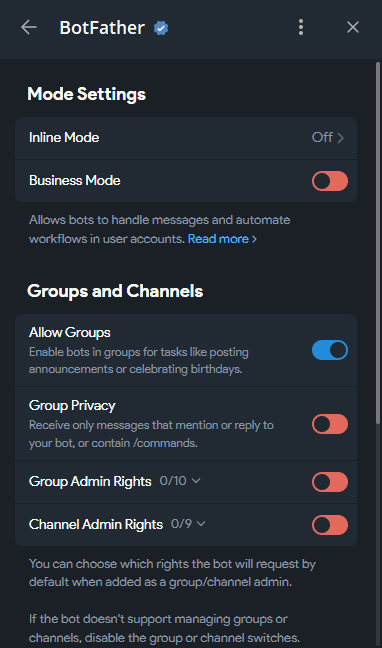

# User Group Bot (Telegram)

Бот для Telegram, который позволяет создавать именованные группы пользователей в чате и упоминать всех участников группы одной меткой `@group`.

## Возможности
- Создание групп на уровне чата (список групп уникален для каждого чата)
- Добавление и удаление участников по `@username` или через `text_mention`
- Список групп и участников группы
- Упоминание всех участников группы при использовании `@group` в обычном сообщении

## Требования
- Java 25
- Gradle 8+
- Telegram Bot Token (ВАЖНО! в настройках бота необходимо выключить Group Privacy)



## Быстрый старт (локально)
1) Установите переменную окружения с токеном бота (Windows PowerShell):
```powershell
$env:TELEGRAM_BOT_TOKEN="YOUR_TOKEN"
```
2) Запустите приложение:
```powershell
./gradlew.bat bootRun
```

## Быстрый старт (через docker-compose)
1) Соберите исполняемый JAR:
```powershell
./gradlew.bat clean bootJar
```
2) Запустите:
```powershell
# экспорт токена
$env:TELEGRAM_BOT_TOKEN="YOUR_TOKEN"

# запуск
docker compose up -d

# логи
docker compose logs -f app
```
- БД: SQLite как файл. В контейнере путь `/data/user-group-bot.db`, на хосте — папка `./db`.
- Сервис запускает JAR вида `user-group-bot.jar` из `build/libs`.

## Конфигурация
Основные параметры задаются в `src/main/resources/application.properties` или через переменные окружения.

Ключевые настройки:
- `telegram.bot.token` — токен бота (по умолчанию берётся из `TELEGRAM_BOT_TOKEN`)
- `spring.datasource.url` — JDBC URL для SQLite: локально `jdbc:sqlite:db/user-group-bot.db`, в compose `jdbc:sqlite:/data/user-group-bot.db`
- `spring.jpa.hibernate.ddl-auto=update` — авто-создание/обновление схемы
- `spring.jpa.properties.hibernate.dialect=org.hibernate.community.dialect.SQLiteDialect` — диалект SQLite

Через docker-compose переопределяются, например:
- `SPRING_DATASOURCE_URL=jdbc:sqlite:/data/user-group-bot.db`
- `SPRING_DATASOURCE_DRIVER_CLASS_NAME=org.sqlite.JDBC`
- `SPRING_JPA_HIBERNATE_DDL_AUTO=update`
- `SPRING_JPA_PROPERTIES_HIBERNATE_DIALECT=org.hibernate.community.dialect.SQLiteDialect`

## Команды бота
- `/add_group <имя_группы>` — создать группу
- `/add_user <имя_группы> @user ...` — добавить пользователя(ей) в группу
- `/delete_user <имя_группы> @user ...` — удалить пользователя(ей) из группы
- `/delete_user @user ...` — удалить пользователя(ей) из всех групп чата
- `/list_groups` — список групп чата
- `/list_users <имя_группы>` — участники группы
- `/help` — краткая справка

## Упоминание группы
Напишите в сообщении `@<имя_группы>` — бот ответит сообщением с перечислением `@username` всех участников группы.

## Архитектура
- Spring Boot + Spring Data JPA
- Сущности: `ChatEntity`, `GroupEntity`, `GroupMemberEntity`
- Репозитории: `ChatRepository`, `GroupRepository`, `GroupMemberRepository`
- Доменный сервис: `GroupService`
- Интеграция с Telegram: `TelegramBotHandler`, `UserGroupService`

## Лицензия
MIT.
